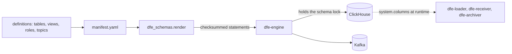

# Architecture

## The problem

Before this repo held the manifest, the order a deployment created its
ClickHouse objects in lived in five places: three Python tuples in dfe-engine, a
Helm helper in dfe-infra and a resolver in dfe-docker. Knowing what a deployment
would create meant reading all five, and the definitions themselves were spread
between engine code and charts. Two components could each be right and still
disagree.

So the shape is one list and one applier. `manifest.yaml` names every object a
deployment creates, in the order it creates them, and dfe-engine is the only
thing that applies it. Adding a table is an entry in that file plus a definition
-- never an engine release, never a Job, never an init container.

## One applier, one caller

dfe-engine reads the pinned wheel at boot, takes the schema lock, renders every
object, compares it against `dfe.schema_migrations` and the live server, applies
what is absent or additively changed, and records each object with the
dfe-schemas version and checksum it came from.

Nothing else creates a ClickHouse database, table, view, TTL, user, role or
grant, or a Kafka topic. Not an ArgoCD Job, not a compose init container, not an
app at runtime, and not the OTel collector -- its exporter runs with
`create_schema: false` precisely because it senses no topology and would create
the same table plain on one replica and `Replicated` on the others.

The Rust services take their columns from the common header, but they read the
DEPLOYED schema out of `system.columns` at runtime. They never read this YAML.

## A package, not a submodule

The schema trees sit at the repository root so a checkout reads as itself. The
wheel carries the same trees as package data under `dfe_schemas/data/`, copied
there by hatch `force-include` at build time. `schemas_root()` resolves whichever
applies: package data when one exists, the repository root otherwise, and
`DFE_SCHEMAS_DIR` overrides both.

This is the fact most readers get wrong, because it used to be a git submodule
and the later sections of `docs/meta-schema.md` still describe one. Code that
needs a definition file goes through `schemas_root()` rather than a relative
path, or it works in a checkout and fails in a wheel.

### One parser

`ruamel.yaml`, not PyYAML, with the same settings dfe-engine reads these files
with. YAML 1.1 resolves `on`, `off`, `yes` and `no` as booleans and YAML 1.2 does
not, so two parsers over one schema tree gives two answers.

### Components

| Module | What it owns |
|--------|--------------|
| `__init__.py` | `schemas_root()` and `manifest_path()` -- the only path resolution |
| `manifest.py` | Reads the manifest and refuses a bad one |
| `loader.py` | Version trees, the two column shapes, composition, the type registry, `quote_ident` |
| `clickhouse.py` | Topology sensing, and the `ENGINE` / `ON CLUSTER` forms |
| `render.py` | One object to statements, for one topology, with a checksum |
| `topics.py` | The Kafka naming rule, defaults and bootstrap set |
| `deploy_defaults.py` | The declared deployment defaults |

## Definitions

### Two column shapes

`tables/**` is written in exact ClickHouse types, because those columns are
engine state and telemetry with nothing to map from. `common-header/**`,
`hunts/**`, `meta/**` and `additional/**` use DFE primitives and map through
`registries/types.yaml`.

The shape is taken from the columns themselves -- a `ch_type` is the exact form,
a `type` is a primitive -- and a file mixing the two is rejected rather than
half-read. Exactly one of the two carries the type. An exact `ch_type` bypasses
the primitive mapping and resolves NON-nullable, which is what a sorting key
needs.

### Version trees and composition

Every definition carries its own version tree. Each entry is a complete column
snapshot, not a delta, and `current` names the default. Versions follow SchemaVer
semantics -- model, addition, revision -- and a published version is immutable,
because consumers pin versions independently and an in-place edit changes what an
already-pinned consumer resolves.

Composition puts header columns first, then whatever the composed definition
adds. The header wins, so a source cannot quietly redefine `_org_id`. A
definition may drop named header columns with `profile_exclude`:
`hunts/results.yaml` drops `_raw` and `_tags` because a detection references its
source by `matched_uuid`, so a second copy of the payload text and an index over
it earn nothing.

## Rendering

### Topology is a parameter, never a literal

The same definition renders three ways: plain for a keeperless node,
`Replicated` for a Replicated database or ClickHouse Cloud, and `Replicated`
plus `ON CLUSTER` for an Atomic database on a real cluster. The topology is
sensed from the live server where there is one, and otherwise taken from the
deployment's setting.

This is the whole reason rendering happens here rather than in a definition. A
literal engine is correct on a single node and lands on ONE replica of a
cluster, where every query succeeds and the answer depends which node answered.

### Checksums ignore the topology

Every rendered object carries a sha256 checksum taken over the statement with
the topology token removed -- the `ON CLUSTER` suffix, the `Replicated` prefix
and the empty argument list that goes with it -- and whitespace collapsed. One
schema therefore reads as one checksum whether it was applied to a single node
or to a cluster, which is what lets the applier's ledger answer "has this object
changed" rather than "was it applied somewhere else".

A `.sql` view's opening comment block is stripped before the statement is
checksummed. Left in, a reworded comment would read as a changed view on every
deployment's next apply.

## The invariants that fail loudly

These are checks, not conventions. Each one exists because its absence produces
something that looks like success.

- **A duplicate object id** is refused: two definitions claiming one name means
  whichever applies second silently wins.
- **A dependency that is unknown or declared later** is refused: a view over a
  table that does not exist yet fails on a fresh cluster and succeeds on every
  re-run, which is the worst shape a bootstrap can have.
- **A Nullable `ORDER BY` key** is refused rather than dropped. ClickHouse
  rejects one unless `allow_nullable_key` is on, and even then a null in the sort
  key cripples the index and doubles storage.
- **A TTL over an absent column** is refused, because the table would silently
  keep every row forever.
- **`ttl_only_drop_parts`** is set only when every TTL column appears in the
  partition expression. It waits for every row in a part to expire, so an
  unaligned TTL would retain data indefinitely -- those tables get the row-level
  delete instead.
- **A role is created before its quota**, because ClickHouse rejects a quota
  naming a role that does not exist yet, and that only shows up against a
  cluster where the role was not already present.
- **Identifiers spliced into a DDL position** go through `quote_ident`.
  Everything shipped here is committed, so this catches an edit rather than an
  attack, but a name carrying a backtick or a semicolon still ends the statement
  early and starts another one.

Every rendered statement converges. An `IF NOT EXISTS` creates and an `ALTER`
re-asserts mutable state, so an edit reaches an object that already exists.

## Why validation sits outside the main CI workflow

`make render` needs nothing but this package, which is how the source of truth
checks its own content. `make validate` is different: it borrows dfe-engine's
loader for the `meta/` models, so the source of truth could not validate itself
without its consumer. `dfe_schemas/loader.py` is that reader vendored back in,
which is why it exists at all.

The remaining cross-repo step lives in `.github/workflows/validate-schemas.yml`
rather than `ci.yml`, for two reasons. hyperi-ci has no stage for a cross-repo
checkout, and folding the step into this repo's pytest suite would put dfe-engine
in dfe-schemas' dependency graph -- a cycle, since dfe-engine depends on the
dfe-schemas wheel.

That job installs dfe-schemas from PyPI as a dfe-engine dependency, but what it
validates is still THIS checkout: `validate_schemas.py` passes explicit paths and
points `DFE_SCHEMAS_DIR` at the repository root.

## How a change reaches a deployment

1. Write the definition, in `tables/` or `views/`.
2. Add it to `manifest.yaml`, after whatever it depends on.
3. `make render` and `make test`.
4. PR to main, then cut a release so the wheel reaches PyPI.
5. Raise the `dfe-schemas` floor in dfe-engine and relock.

Step 5 is the only one that puts a new object in front of a deployment. Nothing
reads this repository directly.
