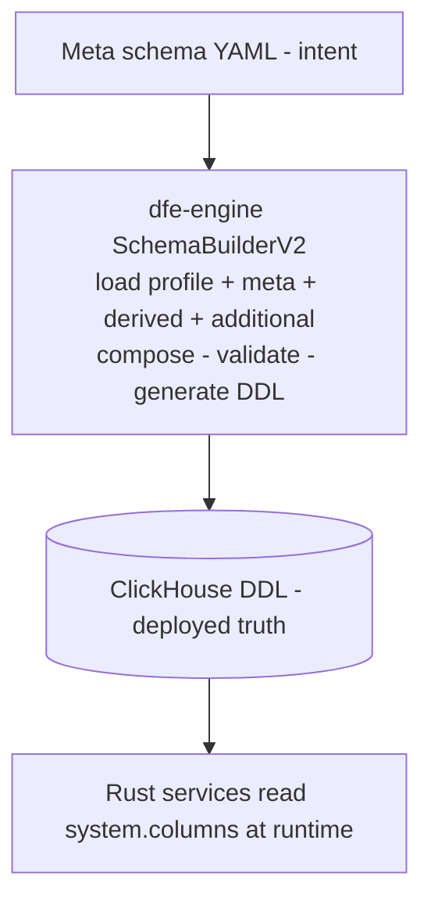

# Meta Schema System

A **meta schema** is a YAML file that defines the columns for a ClickHouse
table - the single source of intent for what a table should look like. The
engine reads it, generates DDL, and applies it to ClickHouse. There is no
schema registry, no intermediate store, no sync state. This page is the
FORMAT reference; the engine classes that consume it are documented in the
dfe-engine repo (`docs/data-plane/schema-classes.md`).



Two sources of truth exist:

1. **Meta schema YAML** — what the schema should be
2. **ClickHouse table** — what the schema actually is

The engine bridges the gap. Rust services (loader, receiver, archiver) slave from the
deployed ClickHouse schema only — they read `system.columns` at runtime, never YAML.

### Where Meta Schemas Live

Meta schemas are YAML files in the `schemas/` submodule (the
[dfe-schemas](https://github.com/hyperi-io/dfe-schemas) repo). Common header profiles,
hunt result schemas, and source-specific schemas all use the same format.

```
schemas/                          <- git submodule (dfe-schemas repo)
|-- common-header/
|   |-- timeseries.yaml           <- 9-column default profile
|   |-- minimal.yaml              <- 5-column high-volume profile
|   '-- passthrough.yaml          <- 4-column transparent bridge
|-- meta/                         <- source meta schemas (aws/ azure/ gcp/ m365/)
|-- additional/                   <- extra-field overlays (aws/)
|-- hunts/
|   |-- results.yaml              <- hunt detection output columns
|   '-- detection_checkpoint.yaml <- runner checkpoint table
|-- argocd/
|   |-- ddl/                      <- generated reference SQL (make render)
|   '-- application.yaml + job.yaml + kustomization.yaml
|-- scripts/                      <- validate / render / annotate
'-- README.md
```

---

## YAML Format

Meta schemas support two layouts: **version tree** (preferred) and **flat** (backward-compatible).

### Version Tree (Preferred)

Each version carries a complete column snapshot. No filtering or reconstruction needed —
read `versions."1.0.0".columns` and you have the full schema for that version.

```yaml
current: "1.0.0"                      # Default version when no pin specified

versions:
  "1.0.0":
    date: "2026-01-15"
    type: model                       # model | addition | revision
    summary: "Initial schema"
    columns:
      - name: user_name
        type: string
        use_case: dimension
        expr: "@source: first(user_id/uid/id)"
        comment: "User identifier"

      - name: source_ip
        type: ip
        use_case: range
        expr: "@source: src_ip"
        comment: "Source IP address"

      - name: message
        type: text
        use_case: fulltext
        comment: "Log message body"
```

### Flat (Backward-Compatible)

Files without `current`/`versions` metadata work unchanged. No versioning — just a
plain column list.

```yaml
columns:
  - name: user_name
    type: string
    use_case: dimension
  - name: message
    type: text
    use_case: fulltext
```

### Version Metadata Fields

| Field | Required | Description |
|-------|----------|-------------|
| `current` | Yes | Default version when consumer doesn't specify a pin |
| `versions` | Yes | Dict of version string → version entry |
| `date` | Yes (per version) | When the version was created (YYYY-MM-DD) |
| `type` | Yes (per version) | Change category: `model`, `addition`, `revision` |
| `summary` | Yes (per version) | Human-readable change description |
| `columns` | Yes (per version) | Complete column snapshot for this version |
| `profile_exclude` | No (per version) | Common-header columns to drop when this schema is composed onto a profile |

`profile_exclude` trims the header for a table that does not need all of it.
`hunts/results.yaml` uses it to drop `_raw` and `_tags`: a detection row
references its source by `matched_uuid`, so a second copy of the payload text
plus an ngram index over it is storage for nothing. Naming a column that the
profile does not have is a no-op, not an error - a profile can legitimately
lack it (`minimal` has no `_raw`).

---

## Column Definition Reference

Each column is a `SchemaColumn`. Only `name` and `type` are required.

```yaml
columns:
  - name: _org_id                    # Required: column name
    type: string                     # Required: primitive type
    attribute: [lowcardinality]      # Optional: storage modifiers
    use_case: dimension              # Optional: query pattern → index
    default: null                    # Optional: DEFAULT expression
    order: 2                         # Optional: ORDER BY position
    expr: "@source: org_id"          # Optional: DFE loader directive
    comment: "Tenant identifier"     # Optional: human description
    ch_override: null                # Optional: exact ClickHouse type
```

### Field Reference

| Field | Type | Default | Description |
|-------|------|---------|-------------|
| `name` | `str` | *(required)* | Column name. System fields use `_` prefix to avoid collision with source data. |
| `type` | `str` | *(required)* | Primitive type — one of 13 values (see [Type System](#type-system)). |
| `attribute` | `list[str]` | `[]` | Storage attributes: `lowcardinality`, `nullable`, `not_null`, `materialized`, `alias`. Accepts a single string or list. |
| `use_case` | `str \| null` | `null` | Query pattern hint that determines index generation: `dimension`, `fulltext`, `text_search`, `range`, `bloom`. |
| `default` | `str \| null` | `null` | Raw ClickHouse DEFAULT expression (e.g. `"now64(3)"`, `"generateUUIDv7()"`). Used as MATERIALIZED or ALIAS expr when those attributes are set. |
| `order` | `int \| null` | `null` | Position in ORDER BY / PRIMARY KEY (0-based). Only columns with `order` set are included in the key. |
| `expr` | `str \| null` | `null` | DFE directive that tells the loader how to populate this column (see [DFE Expressions](#dfe-expressions)). |
| `comment` | `str \| null` | `null` | Human-readable description. |
| `ch_override` | `str \| null` | `null` | Exact ClickHouse type string — bypasses primitive mapping entirely. No auto-Nullable, no auto-codec. |
| `_field_type` | `str \| null` | `null` | Column classification annotation (`base` = shipped by DFE). Maps to the engine model's `field_type`. |
| `max_dynamic_paths` | `int \| null` | `null` | JSON-column dynamic-path budget. Present in shipped profile YAML; engine-side DDL wiring is pending (tracked in the 2nd-pass review report). |
| `synthetic` | `map \| null` | `null` | Synthetic data generation hints (see [Synthetic Data Hints](#synthetic-data-hints)). Ignored by the schema loader and DDL generation. |

### Synthetic Data Hints

A column may carry an optional `synthetic:` mapping that the DFE synthetic
data generator uses when producing synthetic data from this schema - a
realistic continuous inbound stream for sales demos, and repeatable data
for testing. The schema loader ignores the key, so hints never affect
validation or DDL.
Hints are applied in priority order - `static` > `values` > `templates` >
`provider` > `minimum`/`maximum` - and columns without hints fall back to
the engine's semantic heuristics (name/type based).

| Hint | Type | Description |
|------|------|-------------|
| `static` | any | Emit this exact value for every event. |
| `values` | `list` | Categorical vocabulary to draw from. |
| `weights` | `list[float]` | Draw weights aligned with `values`. |
| `templates` | `list[str]` | Message templates with `{placeholder}` tokens filled from the event's entity context (`{username}`, `{ipv4}`, `{external_ipv4}`, `{port}`, `{http_status}`, ...). |
| `provider` | `str` | Faker provider method to call (e.g. `user_agent`). |
| `minimum` / `maximum` | number | Bounds for numeric generation. |
| `format` | `str` | Timestamp rendering: `iso8601` (default), `epoch_s`, `epoch_ms`, or a strftime pattern. |

### Synthetic Data Scenarios

Correlated columns must not draw independently (an sshd message under
`appname: cron` reads as fake). A version entry may carry a `synthetic:`
mapping BESIDE `columns:` whose `scenarios:` list defines coherent event
shapes - one weighted scenario is drawn per event, and its
`values`/`templates` override per-column hints for the columns it names:

```yaml
versions:
  "1.0.0":
    columns: [...]
    synthetic:
      scenarios:
        - name: sshd-auth
          weight: 35
          values:
            app_name: sshd
            facility: [auth, authpriv]     # list draws uniformly
            severity: [info, info, notice] # repeat entries to weight
          templates:
            message:
              - "Failed password for {username} from {external_ipv4} port {port} ssh2"
```

Columns a scenario does not name fall back to per-column hints, then
heuristics. The shipped reference sets (`meta/syslog.yaml`,
`meta/otel/logs.yaml`, `meta/beats/filebeat.yaml`) use scenarios for the
correlated columns and hints for the rest.

### How `expr` and `comment` Become DDL

In the generated DDL, `expr` and `comment` are combined into a single ClickHouse COMMENT
clause. The loader parses `@` directives from the COMMENT at runtime:

```sql
-- Both expr and comment:
`_timestamp` DateTime64(3,'UTC') COMMENT '@source: timestamp | now() — Event timestamp'

-- Expr only:
`_uuid` UUID DEFAULT generateUUIDv7() COMMENT '@generated: generateUUIDv7()'

-- Comment only:
`matched_uuid` UUID COMMENT 'UUID of the matching source record'
```

---

## Type System

### 13 Primitives

Primitives are human-readable type names that map to ClickHouse types with sensible
defaults. You don't need to know ClickHouse storage internals — pick the primitive
that describes your data.

| Primitive | What It Is | ClickHouse Type | Codec | Nullable Default |
|-----------|-----------|-----------------|-------|-----------------|
| `string` | Short-to-medium text (names, IDs, codes) | `String` | `ZSTD(1)` | Yes |
| `text` | Large text (log messages, bodies) | `String` | `ZSTD(3)` | Yes |
| `integer` | Whole number (counts, IDs, event codes) | `Int64` | `ZSTD(1)` | Yes |
| `float` | Decimal number (scores, latency) | `Float64` | `ZSTD(1)` | Yes |
| `boolean` | True/false | `Bool` | `LZ4` | **No** |
| `datetime` | Date and time with timezone | `DateTime64(3,'UTC')` | `Delta, ZSTD(1)` | Yes |
| `timestamp` | Date and time — never null (for ORDER BY) | `DateTime64(3,'UTC')` | `Delta, LZ4` | **No** |
| `date` | Date only | `Date` | `Delta, ZSTD(1)` | Yes |
| `ip` | IP address (v4 or v6) | `IPv6` | `LZ4` | Yes |
| `uuid` | Unique identifier | `UUID` | *(none)* | Yes |
| `json` | Structured/semi-structured data | `JSON` | `ZSTD(3)` | Yes |
| `geo_point` | Latitude/longitude pair | `Point` | `ZSTD(1)` | Yes |
| `enum` | Fixed set of allowed values | `Enum8(...)` | `ZSTD(1)` | **No** |

### Type Wrapping

When the engine resolves a primitive to a ClickHouse type, it applies Nullable and
LowCardinality wrapping based on the primitive's defaults and any explicit attributes:

```
string                            → Nullable(String)
string + [lowcardinality]         → LowCardinality(Nullable(String))
string + [lowcardinality, not_null] → LowCardinality(String)
timestamp                         → DateTime64(3,'UTC')          (not nullable by default)
boolean                           → Bool                         (not nullable by default)
```

Wrapping order: **Nullable wraps inner**, **LowCardinality wraps outer**.

### ClickHouse Type Override (`ch_override`)

When a primitive isn't sufficient, specify the exact ClickHouse type:

```yaml
  - name: http_status
    type: integer
    ch_override: UInt16
    use_case: dimension

  - name: precision_ts
    type: datetime
    ch_override: "DateTime64(6,'UTC')"

  - name: nested_data
    type: string
    ch_override: "Nested(key String, value String)"
```

When `ch_override` is set:
- No automatic Nullable wrapping
- No automatic codec selection
- The type string is used verbatim in DDL
- Attributes are still validated but don't affect type resolution

The engine validates `ch_override` against a catalogue of supported ClickHouse types
(integers, floats, decimals, strings, dates, geo, complex, enums, specials).

---

## Attributes

Attributes modify how the type is stored. Specified as a list in YAML.

| Attribute | What It Does | Valid Primitives |
|-----------|-------------|-----------------|
| `lowcardinality` | Dictionary encoding — huge performance gain for <10K distinct values | `string`, `text`, `integer`, `float`, `date`, `ip` |
| `nullable` | Force NULL allowed (overrides primitive default) | all |
| `not_null` | Force NOT NULL (overrides primitive default) | all |
| `materialized` | Column computed on INSERT, not stored in source data | all |
| `alias` | Virtual column computed at query time | all |

### How Attributes Interact with `default`

The `default` field produces different DDL clauses depending on attributes:

| Attributes | DDL Clause |
|-----------|-----------|
| *(none)* | `DEFAULT {default}` |
| `[materialized]` | `MATERIALIZED {default}` |
| `[alias]` | `ALIAS {default}` |

```yaml
# Materialized: computed on insert from other columns
  - name: day
    type: date
    attribute: [materialized]
    default: "toDate(_timestamp)"

# Alias: virtual, computed at query time
  - name: year
    type: integer
    attribute: [alias]
    default: "toYear(_timestamp)"
```

### Nullability Defaults

Each primitive has a default nullability. Override with `nullable` or `not_null`:

- **Nullable by default:** `string`, `text`, `integer`, `float`, `datetime`, `date`, `ip`, `uuid`, `json`, `geo_point`
- **NOT null by default:** `timestamp`, `boolean`, `enum`

**Why?** `Nullable(T)` stores two columns (data + null bitmap), doubling storage and
halving query speed. ORDER BY columns and booleans default to NOT NULL because null
in these positions destroys index effectiveness.

---

## Use Cases

Use cases describe **how you query the column** — not how it's stored. The engine
translates use cases into ClickHouse indexes.

| Use Case | When to Use | Example Columns |
|----------|------------|-----------------|
| `dimension` | Filter by exact value: `WHERE status = 'error'` | status, severity, org_id |
| `fulltext` | Search words: `WHERE hasToken(message, 'error')` | message, log_body |
| `text_search` | Substring search: `WHERE message LIKE '%refused%'` | syslog_message |
| `range` | Numeric/time ranges: `WHERE latency > 100` | latency_ms, timestamp |
| `bloom` | Find specific IDs in high-cardinality columns | trace_id, request_id |
| *(empty)* | No special query optimisation needed | raw payload, metadata |

### Use Case → Primitive Constraints

| Use Case | Valid Primitives |
|----------|-----------------|
| `dimension` | `string`, `integer`, `boolean`, `enum`, `ip`, `uuid` |
| `fulltext` | `string`, `text` |
| `text_search` | `string`, `text` |
| `range` | `integer`, `float`, `datetime`, `timestamp`, `date`, `ip` |
| `bloom` | `string`, `uuid` |

Invalid combinations are rejected at validation time (e.g. `fulltext` on an `integer`).

### Generated ClickHouse Indexes

| Use Case | Index Type | Granularity | Notes |
|----------|-----------|-------------|-------|
| `dimension` | `set(0)` | 4 | Exact distinct values per granule |
| `fulltext` | `text(tokenizer=splitByNonAlpha)` | 1 | GA text index (v26.2+). Deterministic, row-level filtering. |
| `text_search` | `text(tokenizer=ngrams(3))` | 1 | Character n-gram text index for substring matching. |
| `range` | `minmax` | 4 | Stores min/max per granule |
| `bloom` | `bloom_filter` | 4 | Probabilistic — has false positives, no false negatives |

For ClickHouse < v25.10, the engine falls back to legacy bloom-filter indexes
(`tokenbf_v1`, `ngrambf_v1`) automatically via `use_legacy_indexes=True`.

---

## DFE Expressions

The `expr` field carries directives that tell the loader how to populate each column.
These are emitted as ClickHouse column comments and parsed by the Rust loader from
`system.columns` at runtime.

| Directive | Purpose | Example |
|-----------|---------|---------|
| `@source: field` | Copy from source data | `@source: timestamp \| now()` |
| `@source: first(a/b/c)` | First non-null from list | `@source: first(user_id/uid/id)` |
| `@generated: expr` | ClickHouse generates via DEFAULT — loader omits | `@generated: now64(3)` |
| `@renamed: field` | Zero-copy field rename | `@renamed: logoriginal` |
| `@captured: payload` | Raw payload sidecar | `@captured: raw_payload` |
| `@captured: what as TYPE` | Captured and cast | `@captured: raw_payload as JSON` |
| `@computed: expr` | Derived/enriched value | `@computed: geoip(ip).country_code` |
| `@config: path` | Mapping is configurable | `@config: routing.org_id_field` |

Column comments have **highest precedence** in the loader — above built-in presets
and external remap files. The schema definition IS the authoritative field mapping.

---

## Common Header Profiles

Every DFE table starts with a standard header of underscore-prefixed system fields.
The profile determines which header columns are included.

### Profile Summary

| Profile | Columns | Use Case |
|---------|---------|----------|
| **timeseries** (default) | 9 | Logs, alerts, audit trails — full event ingestion |
| **minimal** | 5 | Metrics, flow records — high-volume structured data |
| **passthrough** | 4 | Transparent bridge — no timestamp injection |

### timeseries (default) — 9 columns

| Column | Type | Attributes | Use Case | ORDER BY | Expr |
|--------|------|------------|----------|----------|------|
| `_timestamp_load` | `timestamp` | | | 0 | `@generated: now64(3)` |
| `_timestamp` | `datetime` | | `range` | 1 | `@source: timestamp \| now()` |
| `_timestamp_received` | `datetime` | | | | `@source: first(timestamp_received/received_at)` |
| `_uuid` | `uuid` | | | | `@generated: generateUUIDv7()` |
| `_org_id` | `string` | `lowcardinality` | `dimension` | 2 | `@source: org_id` |
| `_source` | `string` | `lowcardinality` | `dimension` | | `@source: first(_source) \| topic_name` |
| `_raw` | `text` | | `text_search` | | `@captured: raw_payload` |
| `_json` | `json` | | | | `@captured: raw_payload as JSON` |
| `_tags` | `json` | | | | `@source: first(tags/_tags/meta/metadata.tags)` |

### minimal — 5 columns

`_timestamp_load`, `_timestamp`, `_uuid`, `_org_id`, `_json`

### passthrough — 4 columns

`_timestamp_load`, `_uuid`, `_org_id`, `_json`

### How a Source Selects a Profile

```yaml
# In the Source YAML:
header:
  type: timeseries          # Profile name
  version: "1.0.0"          # Pin to specific profile version
```

Profile columns are injected first. Source-specific columns follow.
If a source column duplicates a profile column name, the profile wins (with warning).

---

## Composition Pipeline

A fully composed schema is built from up to four layers:

```
┌─────────────────────────────────────────────────────────┐
│ 1. Common Header Profile (timeseries/minimal/passthrough)│
│    → SchemaLoader.load_profile("timeseries", version=v) │
│    → [_timestamp_load, _timestamp, _org_id, ...]        │
└─────────────────────────────────────────────────────────┘
                         +
┌─────────────────────────────────────────────────────────┐
│ 2. Meta Schema (base source columns)                    │
│    → SchemaLoader.load_columns("meta/syslog.yaml", v=v) │
│    → [user_name, source_ip, message, ...]               │
└─────────────────────────────────────────────────────────┘
                         +
┌─────────────────────────────────────────────────────────┐
│ 3. Derived Schema (overrides — optional)                │
│    → SchemaLoader.apply_derived_schema(columns, path)   │
│    → Replaces matching columns by name                  │
└─────────────────────────────────────────────────────────┘
                         +
┌─────────────────────────────────────────────────────────┐
│ 4. Additional Fields (append — optional)                │
│    → SchemaLoader.apply_additional_fields(columns, path)│
│    → Appends new columns, overrides existing with warn  │
└─────────────────────────────────────────────────────────┘
                         ↓
┌─────────────────────────────────────────────────────────┐
│ SchemaLoader.compose(profile_columns, source_columns)   │
│ → Profile columns first (wins on duplicates)            │
│ → Source columns appended (deduped)                     │
│ → Final ordered column list                             │
└─────────────────────────────────────────────────────────┘
```

### How It's Wired in a Source YAML

```yaml
source: windows_audit
header:
  type: timeseries
  version: "1.0.0"
schema:
  meta_schema: meta/windows_audit.yaml        # Layer 2: base columns
  meta_schema_version: "2.1.0"                # Pin meta schema version
  derived_schema: derived/windows_custom.yaml  # Layer 3: overrides
  additional_fields: add/windows_extra.yaml    # Layer 4: extra columns
  ttl_days: 90
  engine: MergeTree
```

Schema file paths are resolved relative to `schemas_base_dir` (the schemas directory).

### Composition Semantics

| Layer | Merge behaviour |
|-------|----------------|
| **Profile** | Always comes first. Profile columns cannot be overridden by source columns. |
| **Meta schema** | Base source-specific columns. |
| **Derived schema** | Columns with matching `name` replace the base column entirely. New names are appended. |
| **Additional fields** | New columns are appended. Existing names override with warning. |

---

## DDL Generation

The engine generates complete ClickHouse DDL from composed columns. Here is what
a generated `CREATE TABLE` statement looks like:

```sql
-- HyperI DFE windows_audit 2026-03-03 12:00:00 UTC
CREATE TABLE IF NOT EXISTS {db}.windows_audit
(
    -- Column definitions (profile header first, then source columns)
    `_timestamp_load` DateTime64(3,'UTC') DEFAULT now64(3) CODEC(Delta, LZ4)
        COMMENT '@generated: now64(3) — Insertion timestamp (ms precision)',
    `_timestamp` Nullable(DateTime64(3,'UTC')) CODEC(Delta, ZSTD(1))
        COMMENT '@source: timestamp | now() — Event timestamp from source data',
    `_org_id` LowCardinality(Nullable(String)) CODEC(ZSTD(1))
        COMMENT '@source: org_id — Tenant/organisation identifier',
    `_raw` Nullable(String) CODEC(ZSTD(3))
        COMMENT '@captured: raw_payload — Original event payload as text',
    `_json` JSON CODEC(ZSTD(3))
        COMMENT '@captured: raw_payload as JSON — Original event payload as JSON',
    `user_name` Nullable(String) CODEC(ZSTD(1))
        COMMENT '@source: first(user_id/uid/id) — User identifier',
    `source_ip` Nullable(IPv6) CODEC(LZ4)
        COMMENT '@source: src_ip — Source IP address',

    -- Indexes (generated from use_case)
    INDEX idx__timestamp `_timestamp` TYPE minmax GRANULARITY 4,
    INDEX idx__org_id `_org_id` TYPE set(0) GRANULARITY 4,
    INDEX idx__raw `_raw` TYPE text(tokenizer=ngrams(3)) GRANULARITY 1,
    INDEX idx_user_name `user_name` TYPE set(0) GRANULARITY 4,
    INDEX idx_source_ip `source_ip` TYPE minmax GRANULARITY 4,

    -- Projection (optional, on _timestamp by default)
    PROJECTION timestamp_optimized (SELECT * ORDER BY `_timestamp`)
)
ENGINE = MergeTree()
PARTITION BY toYYYYMMDD(_timestamp_load)
PRIMARY KEY (`_timestamp_load`, `_timestamp`, `_org_id`)
ORDER BY (`_timestamp_load`, `_timestamp`, `_org_id`)
TTL _timestamp + INTERVAL 90 DAY DELETE WHERE _timestamp >= 0,
    _timestamp_load + INTERVAL 90 DAY DELETE WHERE _timestamp_load >= 0
COMMENT '@schema_version: 2 | @profile: timeseries | @profile_version: 1.0.0'
SETTINGS
    index_granularity = 2048,
    ttl_only_drop_parts = 1;
```

### DDL Configuration (`DDLConfig`)

| Field | Default | Description |
|-------|---------|-------------|
| `db` | `"{db}"` | Database placeholder (replaced at deploy time) |
| `engine` | `"MergeTree"` | Table engine: `MergeTree`, `ReplicatedMergeTree`, `SharedMergeTree` |
| `ttl_days` | `90` | Data retention in days. `None` disables TTL. |
| `ttl_columns` | `["_timestamp", "_timestamp_load"]` | Columns used in TTL expressions |
| `partition_column` | `"_timestamp_load"` | `PARTITION BY toYYYYMMDD(column)` |
| `index_granularity` | `2048` | ClickHouse granule size |
| `cluster` | `None` | Optional `ON CLUSTER` clause |
| `sample_by` | `None` | Optional `SAMPLE BY` expression |
| `projection_order_by` | `"_timestamp"` | Projection column. `None` disables projection. |
| `profile` | `None` | Profile name for table comment metadata |
| `profile_version` | `None` | Profile version for table comment metadata |

### Table Comment Metadata

The generated table comment contains machine-readable tags:

```sql
COMMENT '@schema_version: 2 | @profile: timeseries | @profile_version: 1.0.0'
```

This enables runtime detection of schema version and profile for migration tooling.

### Views

The engine generates `CREATE OR REPLACE VIEW` statements for field mapping standards
(Sigma, ECS, CIM). Views alias source column names to standard field names:

```sql
CREATE OR REPLACE VIEW {db}.windows_audit_sigma AS
SELECT
    `source_ip` AS `SourceIP`,
    `user_name` AS `User`,
    `event_id` AS `EventID`,
    *
FROM {db}.windows_audit;
```

Zero storage overhead — views are computed at query time.

---

## Version Management

### Immutable Versions

Published version entries are **never modified**. To change a schema:

1. Add a new version entry with the updated column snapshot
2. Update `current` to point to the new version
3. Commit

### SchemaVer Semantics

Uses SemVer format (`MAJOR.MINOR.PATCH`) with schema-specific semantics:

| Change | Bump | Description | Migration Safety |
|--------|------|-------------|------------------|
| **MODEL** | Major | Column removed, type changed, ORDER BY changed | Manual review required |
| **ADDITION** | Minor | New column added, new default expression | Safe auto-migrate (`ALTER TABLE ADD COLUMN`) |
| **REVISION** | Patch | Comment updated, attribute tweaked | No DDL change |

### Version Pinning

Different sources can pin different versions from the same file:

```yaml
# Source A: pinned to header v1.0.0
header:
  type: timeseries
  version: "1.0.0"
schema:
  meta_schema: meta/syslog.yaml
  meta_schema_version: "1.0.0"

# Source B: pinned to header v1.0.0, meta v2.0.0
header:
  type: timeseries
  version: "1.0.0"
schema:
  meta_schema: meta/syslog.yaml
  meta_schema_version: "2.0.0"
```

No pin (`meta_schema_version: null`) uses the file's `current` marker.

---

## Schema Lifecycle

| Event | DDL Action |
|-------|-----------|
| Source created | `CREATE TABLE IF NOT EXISTS` from profile + source schema |
| Schema field added | `ALTER TABLE ADD COLUMN IF NOT EXISTS` |
| Schema field modified | `ALTER TABLE MODIFY COLUMN` (type/codec/comment) |
| Source disabled | No DDL change — table stays, no new data |
| Source deleted | Table preserved — manual `DROP TABLE` if needed |

The deployed ClickHouse table is always authoritative at runtime.

---

## Using Meta Schemas in the dfe-schemas Repo

### Directory Structure

```
dfe-schemas/
|-- common-header/          # Common header profiles (shipped, read-only)
|   |-- timeseries.yaml
|   |-- minimal.yaml
|   '-- passthrough.yaml
|-- hunts/                  # Hunt output + checkpoint schemas (shipped)
|   |-- results.yaml
|   '-- detection_checkpoint.yaml
|-- meta/                   # Source meta schemas, grouped by provider
|   |-- aws/  azure/  gcp/  m365/
|-- additional/             # Extra-field overlays (optional, e.g. aws/)
|-- argocd/ddl/             # Generated reference SQL (make render)
'-- README.md
```

Derived-schema overlays (`derived/`) are supported by the loader but the
directory does not exist yet - create it beside `additional/` when first
needed.

### Creating a New Meta Schema

1. Create a YAML file in the appropriate directory:

```yaml
# meta/my_new_source.yaml
current: "1.0.0"

versions:
  "1.0.0":
    date: "2026-03-03"
    type: model
    summary: "Initial schema for my_new_source"
    columns:
      - name: event_type
        type: string
        attribute: [lowcardinality]
        use_case: dimension
        comment: "Type of event"

      - name: message
        type: text
        use_case: fulltext
        expr: "@source: message"
        comment: "Event message body"

      - name: severity
        type: string
        attribute: [lowcardinality]
        use_case: dimension
        expr: "@source: severity"

      - name: client_ip
        type: ip
        use_case: range
        expr: "@source: first(client_ip/src_ip/ip)"
        comment: "Client IP address"
```

2. Reference it from a Source definition:

```yaml
source: my_new_source
header:
  type: timeseries
  version: "1.0.0"
schema:
  meta_schema: meta/my_new_source.yaml
  meta_schema_version: "1.0.0"
  ttl_days: 90
  engine: MergeTree
```

### Adding a New Version to an Existing Schema

Add a new version entry with a **complete column snapshot** (not a delta):

```yaml
current: "1.1.0"                    # Updated current marker

versions:
  "1.0.0":
    date: "2026-01-15"
    type: model
    summary: "Initial schema"
    columns:
      - name: event_type
        type: string
        # ... all columns for v1.0.0

  "1.1.0":
    date: "2026-03-03"
    type: addition
    summary: "Added geo_country column"
    columns:
      - name: event_type
        type: string
        # ... all columns from v1.0.0 PLUS:
      - name: geo_country
        type: string
        attribute: [lowcardinality]
        use_case: dimension
        expr: "@computed: geoip(client_ip).country_code"
        comment: "GeoIP country code"
```

Each version is a complete snapshot — copy all existing columns, then add/modify/remove.

### Updating the Submodule Pin

After merging changes to the dfe-schemas repo:

```bash
# In dfe-engine (or any consumer):
cd /projects/dfe-engine
git submodule update --remote schemas
git add schemas
git commit -m "chore: update dfe-schemas submodule"
```

### Keeping Bundled Profiles in Sync

After updating common-header profiles, copy to the bundled fallback location
so `pip install dfe-engine` works without a submodule checkout:

```bash
cp schemas/common-header/*.yaml src/dfe_engine/schema/profiles/
```

### Resolution Chain

Both dfe-engine (Python) and dfe-loader (Rust) use the same resolution order:

1. `DFE_SCHEMAS_DIR` env var → `{dir}/common-header/`
2. `schemas/common-header/` submodule (relative to project root)
3. Bundled `schema/profiles/` inside the package (fallback)

---

## Engine class reference

The engine-side classes that consume this format (SchemaLoader,
SchemaBuilderV2, DDLGenerator, SchemaManager, DDLFileWriter), with worked
examples, validation rules, and gotchas, are documented in the dfe-engine
repo: docs/data-plane/schema-classes.md. One home per fact - this page owns
the YAML FORMAT only.
