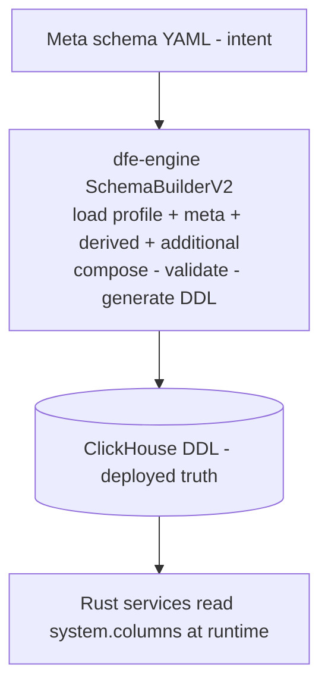
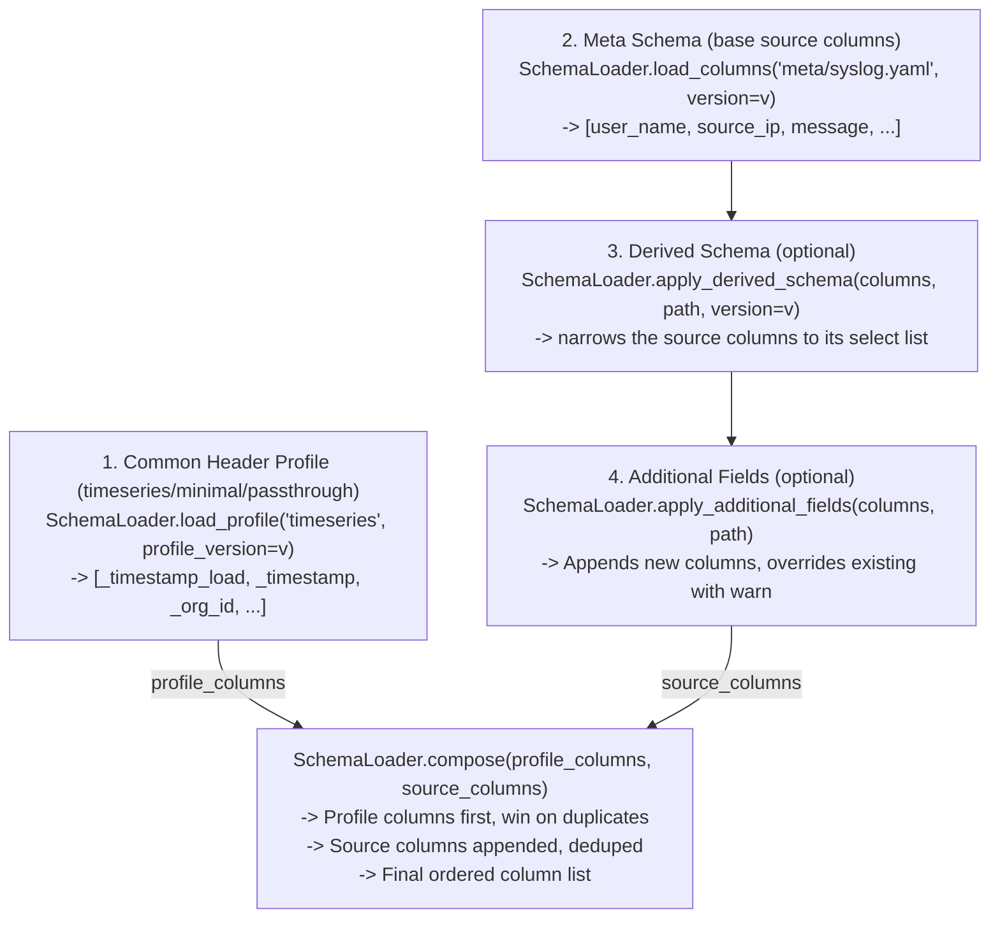

# Meta Schema System

A **meta schema** is a YAML file that defines the columns for a ClickHouse
table - the single source of intent for what a table should look like. The
engine reads it, generates DDL, and applies it to ClickHouse. There is no
schema registry, no intermediate store, no sync state. This page is the
FORMAT reference; the engine classes that consume it are documented in the
dfe-engine repo (`docs/data-plane/schema-classes.md`).


```mermaid
flowchart TB
    YAML[Meta schema YAML - intent] --> B["dfe-engine SchemaBuilderV2<br/>load profile + meta + derived + additional<br/>compose - validate - generate DDL"]
    B --> DDL[(ClickHouse DDL - deployed truth)]
    DDL --> RUST[Rust services read system.columns at runtime]
```

Two sources of truth exist:

1. **Meta schema YAML** -- what the schema should be
2. **ClickHouse table** -- what the schema actually is

The engine bridges the gap. Rust services (loader, receiver, archiver) slave from the
deployed ClickHouse schema only -- they read `system.columns` at runtime, never YAML.

## Where Meta Schemas Live

Meta schemas are YAML files at the root of this repo
([dfe-schemas](https://github.com/hyperi-io/dfe-schemas)), shipped to consumers as the
pinned `dfe-schemas` PyPI wheel. Common header profiles,
hunt result schemas, and source-specific schemas all use the same format.

```text
dfe-schemas/                      <- repo root, shipped as a PyPI wheel
|-- common-header/
|   |-- timeseries.yaml           <- 9-column default profile
|   |-- minimal.yaml              <- 5-column high-volume profile
|   '-- passthrough.yaml          <- 4-column transparent bridge
|-- meta/                         <- source meta schemas (aws/ azure/ gcp/ m365/ runzero/)
|-- additional/                   <- extra-field overlays (<package>/<data_stream>, snapshot/)
|-- derived/                      <- derived schemas: a select list over a base
|-- hunts/
|   |-- results.yaml              <- hunt detection output columns
|   '-- detection_checkpoint.yaml <- runner checkpoint table
|-- scripts/                      <- validate / render / annotate
'-- README.md
```

---

## YAML Format

Meta schemas support two layouts: **version tree** (preferred) and **flat** (backward-compatible).

### Version Tree (Preferred)

Each version carries a complete column snapshot. No filtering or reconstruction needed --
read `versions."1.0.0".columns` and you have the full schema for that version.

```yaml
current: "1.0.0"                      # Default version when no pin specified

versions:
  "1.0.0":
    date: "2026-01-15"
    type: model                       # model | addition | revision
    summary: "Initial schema"
    columns:
      - name: user_name
        type: string
        use_case: dimension
        expr: "@source: first(user_id/uid/id)"
        comment: "User identifier"

      - name: source_ip
        type: ip
        use_case: range
        expr: "@source: src_ip"
        comment: "Source IP address"

      - name: message
        type: text
        use_case: word_search
        comment: "Log message body"
```

### Flat (Backward-Compatible)

Files without `current`/`versions` metadata work unchanged. No versioning -- just a
plain column list.

```yaml
columns:
  - name: user_name
    type: string
    use_case: dimension
  - name: message
    type: text
    use_case: word_search
```

### Version Metadata Fields

| Field | Required | Description |
|-------|----------|-------------|
| `current` | Yes | Default version when consumer doesn't specify a pin |
| `versions` | Yes | Dict of version string -> version entry |
| `date` | Yes (per version) | When the version was created (YYYY-MM-DD) |
| `type` | Yes (per version) | Change category: `model`, `addition`, `revision` |
| `summary` | Yes (per version) | Human-readable change description |
| `columns` | Yes (per version) | Complete column snapshot for this version |
| `profile_exclude` | No (per version) | Common-header columns to drop when this schema is composed onto a profile |

`profile_exclude` trims the header for a table that does not need all of it.
`hunts/results.yaml` uses it to drop `_raw` and `_tags`: a detection row
references its source by `matched_uuid`, so a second copy of the payload text
plus an ngram index over it is storage for nothing. Naming a column that the
profile does not have is a no-op, not an error - a profile can legitimately
lack it (`minimal` has no `_raw`).

---

## Column Definition Reference

Each column is a `SchemaColumn`. Only `name` and `type` are required.

```yaml
columns:
  - name: _org_id                    # Required: column name
    type: string                     # Required: primitive type
    cardinality: low                 # Optional: low | high | unknown
    use_case: dimension              # Optional: query pattern -> index
    attribute: [not_null]            # Optional: storage modifiers
    default: null                    # Optional: DEFAULT expression
    order: 2                         # Optional: ORDER BY position
    expr: "@source: org_id"          # Optional: DFE loader directive
    comment: "Tenant identifier"     # Optional: human description
    ch_override: null                # Optional: exact ClickHouse type
```

### Field Reference

| Field | Type | Default | Description |
|-------|------|---------|-------------|
| `name` | `str` | *(required)* | Column name. System fields use `_` prefix to avoid collision with source data. |
| `type` | `str` | *(required)* | Primitive type -- one of 15 values (see [Type System](#type-system)). |
| `cardinality` | `str` | `unknown` | How many distinct values the column holds: `low`, `high` or `unknown` (see [Cardinality](#cardinality)). |
| `attribute` | `list[str]` | `[]` | Storage attributes: `nullable`, `not_null`, `materialized`, `alias`, and the retired `lowcardinality`. Accepts a single string or list. |
| `use_case` | `str \| null` | `null` | The question the column is asked, which determines index generation: `dimension`, `exact_match`, `range`, `word_search`, `substring_search`, `key_search`, `similarity_search(<dims>)`. |
| `default` | `str \| null` | `null` | Raw ClickHouse DEFAULT expression (e.g. `"now64(3)"`, `"generateUUIDv7()"`). Used as MATERIALIZED or ALIAS expr when those attributes are set. |
| `order` | `int \| null` | `null` | Position in ORDER BY / PRIMARY KEY (0-based). Only columns with `order` set are included in the key. |
| `expr` | `str \| null` | `null` | DFE directive that tells the loader how to populate this column (see [DFE Expressions](#dfe-expressions)). |
| `comment` | `str \| null` | `null` | Human-readable description. |
| `ch_override` | `str \| null` | `null` | Exact ClickHouse type string -- bypasses primitive mapping entirely. No auto-Nullable, no auto-codec. |
| `_field_type` | `str \| null` | `null` | Column classification annotation (`base` = shipped by DFE). Maps to the engine model's `field_type`. |
| `max_dynamic_paths` | `int \| null` | `null` | JSON-column dynamic-path budget. Rendered as `JSON(max_dynamic_paths=N)` on a bare `JSON` column, and ignored on any other type. |
| `synthetic` | `map \| null` | `null` | Synthetic data generation hints (see [Synthetic Data Hints](#synthetic-data-hints)). Ignored by the schema loader and DDL generation. |

### Synthetic Data Hints

A column may carry an optional `synthetic:` mapping that the DFE synthetic
data generator uses when producing synthetic data from this schema - a
realistic continuous inbound stream for sales demos, and repeatable data
for testing. The schema loader ignores the key, so hints never affect
validation or DDL.
Hints are applied in priority order - `static` > `values` > `templates` >
`provider` > `minimum`/`maximum` - and columns without hints fall back to
the engine's semantic heuristics (name/type based).

| Hint | Type | Description |
|------|------|-------------|
| `static` | any | Emit this exact value for every event. |
| `values` | `list` | Categorical vocabulary to draw from. |
| `weights` | `list[float]` | Draw weights aligned with `values`. |
| `templates` | `list[str]` | Message templates with `{placeholder}` tokens filled from the event's entity context (`{username}`, `{ipv4}`, `{external_ipv4}`, `{port}`, `{http_status}`, ...). |
| `provider` | `str` | Faker provider method to call (e.g. `user_agent`). |
| `minimum` / `maximum` | number | Bounds for numeric generation. |
| `format` | `str` | Timestamp rendering: `iso8601` (default), `epoch_s`, `epoch_ms`, or a strftime pattern. |

### Synthetic Data Scenarios

Correlated columns must not draw independently (an sshd message under
`appname: cron` reads as fake). A version entry may carry a `synthetic:`
mapping BESIDE `columns:` whose `scenarios:` list defines coherent event
shapes - one weighted scenario is drawn per event, and its
`values`/`templates` override per-column hints for the columns it names:

```yaml
versions:
  "1.0.0":
    columns: [...]
    synthetic:
      scenarios:
        - name: sshd-auth
          weight: 35
          values:
            app_name: sshd
            facility: [auth, authpriv]     # list draws uniformly
            severity: [info, info, notice] # repeat entries to weight
          templates:
            message:
              - "Failed password for {username} from {external_ipv4} port {port} ssh2"
```

Columns a scenario does not name fall back to per-column hints, then
heuristics. The shipped reference sets (`meta/syslog.yaml`,
`meta/otel/logs.yaml`, `meta/beats/filebeat.yaml`) use scenarios for the
correlated columns and hints for the rest.

### How `expr` and `comment` Become DDL

In the generated DDL, `expr` and `comment` are combined into a single ClickHouse COMMENT
clause. The loader parses the `@` directives it acts on from the COMMENT at runtime
(see "DFE Expressions" above for which ones):

```sql
-- Both expr and comment:
`_timestamp` DateTime64(3,'UTC') COMMENT '@source: timestamp | now() - Event timestamp'

-- Expr only (descriptive -- the DEFAULT clause is what the loader actually reads):
`_uuid` UUID DEFAULT generateUUIDv7() COMMENT '@generated: generateUUIDv7()'

-- Comment only:
`matched_uuid` UUID COMMENT 'UUID of the matching source record'
```

---

## Type System

### 15 Primitives

Primitives are human-readable type names that map to ClickHouse types with sensible
defaults. You don't need to know ClickHouse storage internals -- pick the primitive
that describes your data.

| Primitive | What It Is | ClickHouse Type | Codec | Nullable Default |
|-----------|-----------|-----------------|-------|-----------------|
| `string` | Short-to-medium text (names, IDs, codes) | `String` | `ZSTD(1)` | Yes |
| `text` | Large text (log messages, bodies) | `String` | `ZSTD(3)` | Yes |
| `integer` | Whole number (counts, IDs, event codes) | `Int64` | `ZSTD(1)` | Yes |
| `float` | Decimal number (scores, latency) | `Float64` | `ZSTD(1)` | Yes |
| `boolean` | True/false | `Bool` | `LZ4` | **No** |
| `datetime` | Date and time with timezone | `DateTime64(3,'UTC')` | `Delta, ZSTD(1)` | Yes |
| `timestamp` | Date and time -- never null (for ORDER BY) | `DateTime64(3,'UTC')` | `Delta, LZ4` | **No** |
| `date` | Date only | `Date` | `Delta, ZSTD(1)` | Yes |
| `ip` | IP address (v4 or v6) | `IPv6` | `LZ4` | Yes |
| `uuid` | Unique identifier | `UUID` | *(none)* | Yes |
| `json` | Structured/semi-structured data | `JSON` | `ZSTD(3)` | Yes |
| `geo_point` | Latitude/longitude pair | `Point` | `ZSTD(1)` | Yes |
| `enum` | Fixed set of allowed values | `Enum8(...)` | `ZSTD(1)` | **No** |
| `map` | String-keyed attributes (labels, tags) | `Map(LowCardinality(String), String)` | `ZSTD(1)` | **No** |
| `vector` | Embedding for similarity search | `Array(Float32)` | `ZSTD(1)` | **No** |

ClickHouse refuses `Map` and `Array` inside `Nullable`, so neither of the last two
can be null.

### Type Wrapping

Nullable comes from the primitive's default and the `nullable` / `not_null`
attributes. LowCardinality comes from `cardinality` and nothing else:

```text
string                                  -> Nullable(String)
string + cardinality: low               -> LowCardinality(Nullable(String))
string + cardinality: low + [not_null]  -> LowCardinality(String)
string + cardinality: high              -> Nullable(String)
timestamp                               -> DateTime64(3,'UTC')   (not nullable by default)
boolean                                 -> Bool                  (not nullable by default)
```

Wrapping order: **Nullable wraps inner**, **LowCardinality wraps outer**.

### ClickHouse Type Override (`ch_override`)

When a primitive isn't sufficient, specify the exact ClickHouse type:

```yaml
  - name: http_status
    type: integer
    ch_override: UInt16
    use_case: dimension

  - name: precision_ts
    type: datetime
    ch_override: "DateTime64(6,'UTC')"

  - name: nested_data
    type: string
    ch_override: "Nested(key String, value String)"
```

When `ch_override` is set:

- No automatic Nullable wrapping
- No automatic codec selection
- The type string is used verbatim in DDL
- Attributes are still validated but don't affect type resolution

The engine validates `ch_override` against a catalogue of supported ClickHouse types
(integers, floats, decimals, strings, dates, geo, complex, enums, specials).

---

## Cardinality

How many distinct values the column holds. One declaration, because it decides
two things that used to be set apart with nothing keeping them in agreement:
`attribute: [lowcardinality]` was the storage decision, hand-set, and
`exact_match` choosing `set(0)` over `bloom_filter` was the index decision,
derived separately.

| Value | Storage | `exact_match` index |
|-------|---------|---------------------|
| `low` | `LowCardinality(...)` | `set(0)` -- holds every distinct value exactly |
| `high` | plain | `bloom_filter` -- bounded, probabilistic |
| `unknown` *(default)* | plain | `bloom_filter` |

`unknown` is the honest default. Nobody re-reviews a field that already looks
decided, so a column with nothing measured says so, and gets the safe way to be
wrong: no dictionary, and an index whose cost does not grow with the column.

Measure it rather than guess it. An Elasticsearch index template does not carry
cardinality, so the converter and the Rust `dfe-schemagen` port both leave it
`unknown` -- correctly. `dfe-engine`'s data-shape service reads it from the rows
that have already landed (`dfe_engine.services.schema.data_shape_service`) and
returns a reading carrying the distinct count, the rows it covers and the date
it was taken.

`attribute: [lowcardinality]` is the retired spelling and still reads as
`cardinality: low`. Declaring the two against each other is an error, not
something the loader resolves quietly.

---

## Attributes

Attributes modify how the type is stored. Specified as a list in YAML.

| Attribute | What It Does | Valid Primitives |
|-----------|-------------|-----------------|
| `lowcardinality` | Retired -- the old spelling of `cardinality: low` | `string`, `text`, `integer`, `float`, `date`, `ip` |
| `nullable` | Force NULL allowed (overrides primitive default) | all |
| `not_null` | Force NOT NULL (overrides primitive default) | all |
| `materialized` | Column computed on INSERT, not stored in source data | all |
| `alias` | Virtual column computed at query time | all |

### How Attributes Interact with `default`

The `default` field produces different DDL clauses depending on attributes:

| Attributes | DDL Clause |
|-----------|-----------|
| *(none)* | `DEFAULT {default}` |
| `[materialized]` | `MATERIALIZED {default}` |
| `[alias]` | `ALIAS {default}` |

```yaml
# Materialized: computed on insert from other columns
  - name: day
    type: date
    attribute: [materialized]
    default: "toDate(_timestamp)"

# Alias: virtual, computed at query time
  - name: year
    type: integer
    attribute: [alias]
    default: "toYear(_timestamp)"
```

### Nullability Defaults

Each primitive has a default nullability. Override with `nullable` or `not_null`:

- **Nullable by default:** `string`, `text`, `integer`, `float`, `datetime`, `date`, `ip`, `uuid`, `json`, `geo_point`
- **NOT null by default:** `timestamp`, `boolean`, `enum`, `map`, `vector`

**Why?** `Nullable(T)` stores two columns (data + null bitmap), doubling storage and
halving query speed. ORDER BY columns and booleans default to NOT NULL because null
in these positions destroys index effectiveness.

---

## Use Cases

A use case names **the question you ask the column** -- never the ClickHouse index
that answers it. You declare the question, the engine picks the primitive, and it
can pick a different one on a later ClickHouse without your schema changing.

| Use Case | The question | Example Columns |
|----------|------------|-----------------|
| `dimension` | I filter and group by this: `WHERE status = 'error'` | status, severity, org_id |
| `exact_match` | I look up specific values | trace_id, request_id |
| `range` | I query ranges, between, time windows: `WHERE latency > 100` | latency_ms, timestamp |
| `word_search` | I search for whole words: `WHERE hasToken(message, 'error')` | message, log_body |
| `substring_search` | I search for fragments inside words: `WHERE message LIKE '%refused%'` | syslog_message |
| `key_search` | I search the keys and values of a map column | attributes, labels |
| `similarity_search(<dims>)` | I find records similar to this one | embedding |
| *(empty)* | No index | raw payload, metadata |

`similarity_search` is the one use case that takes an argument: ClickHouse needs
the vector's dimension count up front and cannot read it off the column.

### Use Case -> Primitive Constraints

| Use Case | Valid Primitives |
|----------|-----------------|
| `dimension` | `string`, `integer`, `boolean`, `enum`, `ip`, `uuid` |
| `exact_match` | `string`, `uuid` |
| `range` | `integer`, `float`, `datetime`, `timestamp`, `date`, `ip` |
| `word_search` | `string`, `text` |
| `substring_search` | `string`, `text` |
| `key_search` | `map` |
| `similarity_search` | `vector` |

Invalid combinations are rejected at validation time (e.g. `word_search` on an `integer`).

### Generated ClickHouse Indexes

What the engine emits today, on ClickHouse 26.3. These are the engine's answers,
not part of the vocabulary -- read them to size the cost, not to name a column.

| Use Case | Index Type | Granularity | Notes |
|----------|-----------|-------------|-------|
| `dimension` | `set(0)` | 4 | Exact distinct values per granule |
| `exact_match` | `set(0)` on `cardinality: low`, else `bloom_filter` | 4 | The bloom filter is probabilistic -- false positives, no false negatives |
| `range` | `minmax` | 4 | Stores min/max per granule |
| `word_search` | `text(tokenizer=splitByNonAlpha)` | 1 | GA text index (v26.2+). Deterministic, row-level filtering. |
| `substring_search` | `text(tokenizer=ngrams(3))` | 1 | Character n-gram text index for substring matching. |
| `key_search` | two indexes, `text(tokenizer=array)` over `mapKeys(col)` and `mapValues(col)` | 1 | A text index refuses a `Map` column itself, so the keys and the values are indexed apart |
| `similarity_search(<dims>)` | `vector_similarity('hnsw', 'cosineDistance', <dims>)` | 1 | `hnsw` is the only method 26.3 implements |

For ClickHouse < v25.10, `word_search` and `substring_search` fall back to the
legacy `tokenbf_v1` and `ngrambf_v1` indexes automatically via
`use_legacy_indexes=True`.

---

## DFE Expressions

The `expr` field carries directives, emitted as ClickHouse column comments. The
Rust loader reads them back from `system.columns` at runtime, but of the five
distinct directives below it only acts on three -- `@source`, `@renamed`,
`@computed`. `@generated` and `@config` are dropped as unknown directives
(`DIRECTIVE_NAMES` in dfe-loader's `src/column_meta/mod.rs`).

| Directive | Purpose | Example | Loader-parsed |
|-----------|---------|---------|----------------|
| `@source: field` | Copy from source data | `@source: timestamp \| now()` | Yes |
| `@source: first(a/b/c)` | First non-null from list | `@source: first(user_id/uid/id)` | Yes |
| `@generated: expr` | Descriptive: ClickHouse generates via DEFAULT | `@generated: now64(3)` | No -- see below |
| `@renamed: field` | Zero-copy field rename | `@renamed: logoriginal` | Yes |
| `@computed: expr` | Derived/enriched value | `@computed: geoip(ip).country_code` | Yes |
| `@config: path` | Descriptive: mapping is configurable | `@config: routing.org_id_field` | No -- see below |

`@generated` describes a DEFAULT/MATERIALIZED/ALIAS clause that already lives
in the column's own `default:`/`attribute:` fields; the loader omits the field
because it reads that clause's kind straight from `system.columns`
(`default_kind`), not because it parsed the `@generated:` text. `@config`
documents that some other field's value is driven by loader config (for
example `routing.org_id_field`) rather than hardcoded -- the loader never
reads the comment's path to resolve it. See dfe-loader
`docs/clickhouse/DDL-DIRECTIVES.md` for the full mechanism.

`_raw` and `_json` carry no directive. What they hold depends on the loader's
capture mode, not on an `expr`.

Column comments have **highest precedence** in the loader -- above built-in presets
and external remap files. The schema definition IS the authoritative field mapping.

---

## Common Header Profiles

Every DFE table starts with a standard header of underscore-prefixed system fields.
The profile determines which header columns are included.

### Profile Summary

| Profile | Columns | Use Case |
|---------|---------|----------|
| **timeseries** (default) | 9 | Logs, alerts, audit trails -- full event ingestion |
| **minimal** | 5 | Metrics, flow records -- high-volume structured data |
| **passthrough** | 4 | Transparent bridge -- no timestamp injection |

### timeseries (default) -- 9 columns

| Column | Type | Cardinality | Use Case | ORDER BY | Expr |
|--------|------|-------------|----------|----------|------|
| `_timestamp_load` | `timestamp` | | | 0 | `@generated: now64(3)` |
| `_timestamp` | `timestamp` | | `range` | 1 | `@source: timestamp \| now()` |
| `_timestamp_received` | `timestamp` | | | | `@source: first(_timestamp_received/_timestamp_receiver/timestamp_received/received_at)` |
| `_uuid` | `uuid` | | | | `@generated: generateUUIDv7()` |
| `_org_id` | `string` | `low` | `dimension` | 2 | `@source: org_id` |
| `_source` | `string` | `low` | `dimension` | | `@source: first(_source) \| topic_name` |
| `_raw` | `text` | | `substring_search` | | capture mode |
| `_json` | `json` | | | | capture mode |
| `_tags` | `json` | | | | `@source: first(tags/_tags/meta/metadata.tags)` |

### minimal -- 5 columns

`_timestamp_load`, `_timestamp`, `_uuid`, `_org_id`, `_json`

### passthrough -- 4 columns

`_timestamp_load`, `_uuid`, `_org_id`, `_json`

### How a Source Selects a Profile

```yaml
# In the Source YAML:
header:
  type: timeseries          # Profile name
  version: "1.0.0"          # Pin to specific profile version
```

Profile columns are injected first. Source-specific columns follow.
If a source column duplicates a profile column name, the profile wins (with warning).

---

## Composition Pipeline

A fully composed schema is built from up to four layers:


```mermaid
flowchart TD
    S1["1. Common Header Profile (timeseries/minimal/passthrough)<br/>SchemaLoader.load_profile('timeseries', profile_version=v)<br/>-> [_timestamp_load, _timestamp, _org_id, ...]"]
    S2["2. Meta Schema (base source columns)<br/>SchemaLoader.load_columns('meta/syslog.yaml', version=v)<br/>-> [user_name, source_ip, message, ...]"]
    S3["3. Derived Schema (optional)<br/>SchemaLoader.apply_derived_schema(columns, path, version=v)<br/>-> narrows the source columns to its select list"]
    S4["4. Additional Fields (optional)<br/>SchemaLoader.apply_additional_fields(columns, path)<br/>-> Appends new columns, overrides existing with warn"]
    COMPOSE["SchemaLoader.compose(profile_columns, source_columns)<br/>-> Profile columns first, win on duplicates<br/>-> Source columns appended, deduped<br/>-> Final ordered column list"]

    S1 -->|profile_columns| COMPOSE
    S2 --> S3
    S3 --> S4
    S4 -->|source_columns| COMPOSE
```

### How It's Wired in a Source YAML

```yaml
source: windows_audit
header:
  type: timeseries
  version: "1.0.0"
schema:
  meta_schema: meta/windows_audit.yaml        # Layer 2: base columns
  meta_schema_version: "2.1.0"                # Pin meta schema version
  derived_schema: derived/windows_custom.yaml  # Layer 3: narrows to a select list
  additional_fields: add/windows_extra.yaml    # Layer 4: extra columns
  ttl_days: 90
  engine: MergeTree
```

Schema file paths are resolved relative to `schemas_base_dir` (the schemas directory).

### Composition Semantics

| Layer | Merge behaviour |
|-------|----------------|
| **Profile** | Always comes first. Profile columns cannot be overridden by source columns. |
| **Meta schema** | Base source-specific columns. |
| **Derived schema** | Narrows the source columns to its `select` list, in that order. A selected column may override `index` and nothing else; a name the base lacks is an error. |
| **Additional fields** | New columns are appended. Existing names override with warning. |

---

## DDL Generation

The engine generates complete ClickHouse DDL from composed columns. Here is what
a generated `CREATE TABLE` statement looks like:

```sql
-- HyperI DFE windows_audit 2026-03-03 12:00:00 UTC
CREATE TABLE IF NOT EXISTS {db}.windows_audit
(
    -- Column definitions (profile header first, then source columns)
    `_timestamp_load` DateTime64(3,'UTC') DEFAULT now64(3) CODEC(Delta, LZ4)
        COMMENT '@generated: now64(3) - Insertion timestamp (ms precision)',
    `_timestamp` Nullable(DateTime64(3,'UTC')) CODEC(Delta, ZSTD(1))
        COMMENT '@source: timestamp | now() - Event timestamp from source data',
    `_org_id` LowCardinality(Nullable(String)) CODEC(ZSTD(1))
        COMMENT '@source: org_id - Tenant/organisation identifier',
    `_raw` Nullable(String) CODEC(ZSTD(3))
        COMMENT 'Raw payload text, when the loader capture mode writes one',
    `_json` JSON CODEC(ZSTD(3))
        COMMENT 'The payload as structured JSON, when the loader capture mode writes one',
    `user_name` Nullable(String) CODEC(ZSTD(1))
        COMMENT '@source: first(user_id/uid/id) - User identifier',
    `source_ip` Nullable(IPv6) CODEC(LZ4)
        COMMENT '@source: src_ip - Source IP address',

    -- Indexes (generated from use_case)
    INDEX idx__timestamp `_timestamp` TYPE minmax GRANULARITY 4,
    INDEX idx__org_id `_org_id` TYPE set(0) GRANULARITY 4,
    INDEX idx__raw `_raw` TYPE text(tokenizer=ngrams(3)) GRANULARITY 1,
    INDEX idx_user_name `user_name` TYPE set(0) GRANULARITY 4,
    INDEX idx_source_ip `source_ip` TYPE minmax GRANULARITY 4,

    -- Projection (optional, on _timestamp by default)
    PROJECTION timestamp_optimized (SELECT * ORDER BY `_timestamp`)
)
ENGINE = MergeTree()
PARTITION BY toYYYYMMDD(_timestamp_load)
PRIMARY KEY (`_timestamp_load`, `_timestamp`, `_org_id`)
ORDER BY (`_timestamp_load`, `_timestamp`, `_org_id`)
TTL _timestamp + INTERVAL 90 DAY DELETE WHERE _timestamp >= 0,
    _timestamp_load + INTERVAL 90 DAY DELETE WHERE _timestamp_load >= 0
COMMENT '@schema_version: 2 | @profile: timeseries | @profile_version: 1.0.0'
SETTINGS
    index_granularity = 2048,
    ttl_only_drop_parts = 1;
```

### DDL Configuration (`DDLConfig`)

| Field | Default | Description |
|-------|---------|-------------|
| `db` | `"{db}"` | Database placeholder (replaced at deploy time) |
| `engine` | `"MergeTree"` | Table engine: `MergeTree`, `ReplicatedMergeTree`, `SharedMergeTree` |
| `ttl_days` | `None` | Data retention in days. `None` takes the deployment default on a time-series table, and disables TTL where no default is set. |
| `ttl_columns` | `["_timestamp", "_timestamp_load"]` | Columns used in TTL expressions |
| `partition_column` | `"_timestamp_load"` | `PARTITION BY toYYYYMMDD(column)` |
| `index_granularity` | `2048` | ClickHouse granule size |
| `cluster` | `None` | Optional `ON CLUSTER` clause |
| `sample_by` | `None` | Optional `SAMPLE BY` expression |
| `projection_order_by` | `"_timestamp"` | Projection column. `None` disables projection. |
| `profile` | `None` | Profile name for table comment metadata |
| `profile_version` | `None` | Profile version for table comment metadata |

### Table Comment Metadata

The generated table comment contains machine-readable tags:

```sql
COMMENT '@schema_version: 2 | @profile: timeseries | @profile_version: 1.0.0'
```

This enables runtime detection of schema version and profile for migration tooling.

### Views

The engine generates `CREATE OR REPLACE VIEW` statements for field mapping standards
(Sigma, ECS, CIM). Views alias source column names to standard field names:

```sql
CREATE OR REPLACE VIEW {db}.windows_audit_sigma AS
SELECT
    `source_ip` AS `SourceIP`,
    `user_name` AS `User`,
    `event_id` AS `EventID`,
    *
FROM {db}.windows_audit;
```

Zero storage overhead -- views are computed at query time.

---

## Version Management

### Immutable Versions

Published version entries are **never modified**. To change a schema:

1. Add a new version entry with the updated column snapshot
2. Update `current` to point to the new version
3. Commit

### SchemaVer Semantics

Uses SemVer format (`MAJOR.MINOR.PATCH`) with schema-specific semantics:

| Change | Bump | Description | Migration Safety |
|--------|------|-------------|------------------|
| **MODEL** | Major | Column removed, type changed, ORDER BY changed | Manual review required |
| **ADDITION** | Minor | New column added, new default expression | Safe auto-migrate (`ALTER TABLE ADD COLUMN`) |
| **REVISION** | Patch | Comment updated, attribute tweaked | No DDL change |

### Version Pinning

Different sources can pin different versions from the same file:

```yaml
# Source A: pinned to header v1.0.0
header:
  type: timeseries
  version: "1.0.0"
schema:
  meta_schema: meta/syslog.yaml
  meta_schema_version: "1.0.0"

# Source B: pinned to header v1.0.0, meta v2.0.0
header:
  type: timeseries
  version: "1.0.0"
schema:
  meta_schema: meta/syslog.yaml
  meta_schema_version: "2.0.0"
```

No pin (`meta_schema_version: null`) uses the file's `current` marker.

---

## Schema Lifecycle

| Event | DDL Action |
|-------|-----------|
| Source created | `CREATE TABLE IF NOT EXISTS` from profile + source schema |
| Schema field added | `ALTER TABLE ADD COLUMN IF NOT EXISTS` |
| Schema field modified | `ALTER TABLE MODIFY COLUMN` (type/codec/comment) |
| Source disabled | No DDL change -- table stays, no new data |
| Source deleted | Table preserved -- manual `DROP TABLE` if needed |

The deployed ClickHouse table is always authoritative at runtime.

---

## Using Meta Schemas in the dfe-schemas Repo

### Directory Structure

```text
dfe-schemas/
|-- common-header/          # Common header profiles (shipped, read-only)
|   |-- timeseries.yaml
|   |-- minimal.yaml
|   '-- passthrough.yaml
|-- hunts/                  # Hunt output + checkpoint schemas (shipped)
|   |-- results.yaml
|   '-- detection_checkpoint.yaml
|-- meta/                   # Source meta schemas, grouped by provider
|   |-- aws/  azure/  beats/  elastic/  gcp/  m365/  otel/  runzero/
|-- additional/             # Extra-field overlays (<package>/<data_stream>, snapshot/)
|-- derived/                # Derived schemas: a select list over a base
'-- README.md
```

### Generating a Meta Schema from Live Rows

A provider whose export is wider than its documentation (runZero's is) gets
its meta schema from a dump of real rows, not from the docs:
`scripts/generate_meta_schemas.py` reads a directory of `<store>.jsonl` files
(one JSON object per line), takes the union of keys across every row, types
each column from the values it saw, and writes `meta/<provider>/<store>.yaml`
in the version-tree layout. The typing rules, the row-key handling and the
`ch_override: Array(...)` escape for list values are in the script's
docstring; the provider's arguments live in an `@` file beside it
(`scripts/meta-runzero.args`), so a regeneration is one command and
`--check` proves the checked-in files still match the dump.

### Generating the Elastic ECS Meta Schema

`meta/elastic/ecs.yaml` is the ECS vocabulary shared by every Beat and the Elastic Agent, generated rather than written: at 1018 columns nobody maintains it by hand. The generator is the `dfe-schemagen` crate in `dfe-transform-elastic-dev`, which takes column types from the ECS spec and the set of referenced names from an `elastic/integrations` clone. A field's column falls out of its whole spec entry, not its `type` alone: `normalize: [array]` makes an array column, `object_type` a searchable map, and `index: false` drops the index Elasticsearch itself never uses.

Both inputs are pinned by commit. `--ecs-version` has no default, so the version on the output is always one somebody chose:

| Input | Pin |
|-------|-----|
| `elastic/ecs` | v9.5.0, released 2026-08-04, commit `401807e0547301525acd28c4fb667203fec66d59` |
| `elastic/integrations` | commit `2c934eb5223bdfcf0ea0db9e3230154933352bda` |

```bash
env DFE_ECS_SPEC=<ecs checkout>/generated/ecs/ecs_flat.yml \
    DFE_ELASTIC_SOURCES=<clone root> \
  cargo run -p dfe-schemagen --release -- \
    --out <tree> --date <YYYY-MM-DD> --ecs-version 9.5.0
```

`--date` is passed rather than read from the clock, so the same inputs render the same bytes on any day.

Every column declares `cardinality: unknown`. An Elasticsearch index template carries no cardinality and the generator cannot measure one, so it says so instead of guessing: `exact_match` on an undeclared column renders a bounded `bloom_filter` rather than a dictionary the column may never earn.

### Store-Snapshot Stores

A store that arrives as a periodic full dump (dfe-fetcher's dump shape) lands
every frame inside a snapshot envelope: `kind`, `snapshot_id`, `snapshot_at`,
`store`, `seq`, the `end` marker's `row_count` and `completed_at`, with the
provider's record under `record`. The envelope columns are declared once in
`additional/snapshot/envelope.yaml` and composed onto each store through
`schema.additional_fields`; the per-store meta schema reads
`@source: record.<key>`. The envelope's `timestamp` repeats `snapshot_at`, so
the header's `_timestamp` groups a whole dump with no extra wiring.

### Creating a New Meta Schema

1. Create a YAML file in the appropriate directory:

   ```yaml
   # meta/my_new_source.yaml
   current: "1.0.0"

   versions:
     "1.0.0":
       date: "2026-03-03"
       type: model
       summary: "Initial schema for my_new_source"
       columns:
         - name: event_type
           type: string
           cardinality: low
           use_case: dimension
           comment: "Type of event"

         - name: message
           type: text
           use_case: word_search
           expr: "@source: message"
           comment: "Event message body"

         - name: severity
           type: string
           cardinality: low
           use_case: dimension
           expr: "@source: severity"

         - name: client_ip
           type: ip
           use_case: range
           expr: "@source: first(client_ip/src_ip/ip)"
           comment: "Client IP address"
   ```

2. Reference it from a Source definition:

   ```yaml
   source: my_new_source
   header:
     type: timeseries
     version: "1.0.0"
   schema:
     meta_schema: meta/my_new_source.yaml
     meta_schema_version: "1.0.0"
     ttl_days: 90
     engine: MergeTree
   ```

### Adding a New Version to an Existing Schema

Add a new version entry with a **complete column snapshot** (not a delta):

```yaml
current: "1.1.0"                    # Updated current marker

versions:
  "1.0.0":
    date: "2026-01-15"
    type: model
    summary: "Initial schema"
    columns:
      - name: event_type
        type: string
        # ... all columns for v1.0.0

  "1.1.0":
    date: "2026-03-03"
    type: addition
    summary: "Added geo_country column"
    columns:
      - name: event_type
        type: string
        # ... all columns from v1.0.0 PLUS:
      - name: geo_country
        type: string
        cardinality: low
        use_case: dimension
        expr: "@computed: geoip(client_ip).country_code"
        comment: "GeoIP country code"
```

Each version is a complete snapshot -- copy all existing columns, then add/modify/remove.

### Updating the Version Pin

After merging changes to the dfe-schemas repo and cutting a release, raise the
floor in the consumer's `pyproject.toml` and relock:

```bash
# In dfe-engine (or any consumer):
# bump the dfe-schemas floor in pyproject.toml, e.g. "dfe-schemas>=0.2.9"
uv lock
git add pyproject.toml uv.lock
git commit -m "fix: bump dfe-schemas pin"
```

### Bundled Profiles

The wheel carries `common-header/` (and
the rest of the schema trees) as package data under `dfe_schemas/data/`, so
bumping the version pin above is the whole update.

### Resolution Chain

dfe-engine resolves the common-header profiles in this order, first match wins. dfe-loader reads no schema files at runtime: it takes the same directives from the ClickHouse column comments the engine wrote.

1. An explicit `profiles_dir` argument to `SchemaLoader.load_profile`, which skips the rest of the chain
2. `DFE_SCHEMAS_DIR` env var -> `{dir}/common-header/`
3. `common-header/` under the installed `dfe-schemas` package (via `importlib.resources`)
4. `common-header/` under the image's schema seed directory (`DFE_SCHEMAS_SEED_DIR`, default `/app/schemas-seed`)

---

## Engine class reference

The engine-side classes that consume this format (SchemaLoader,
SchemaBuilderV2, DDLGenerator, SchemaManager, DDLFileWriter), with worked
examples, validation rules, and gotchas, are documented in the dfe-engine
repo: docs/data-plane/schema-classes.md. One home per fact - this page owns
the YAML FORMAT only.
